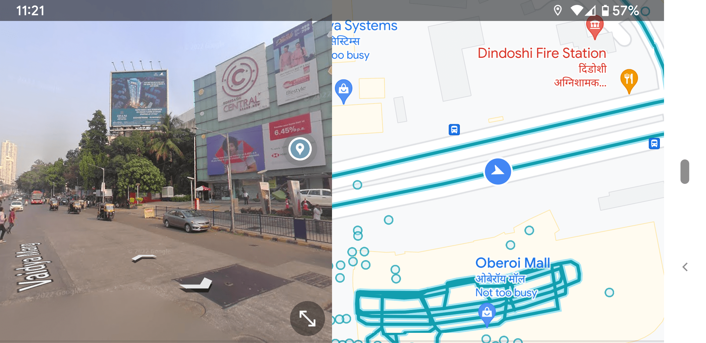
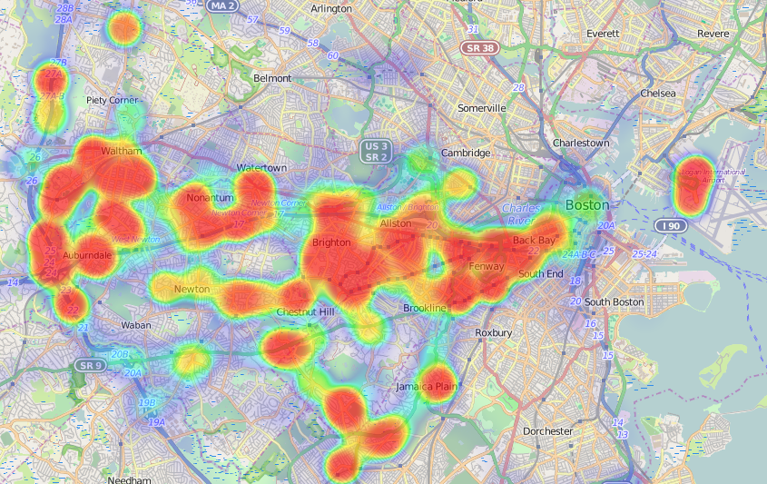

# Kannada Checker

## Table of Contents

- [Problem Statement and Motivation](#problem-statement-and-motivation)
- [Installation](#installation)
- [Approach / Workflow](#approach--workflow)
  - [Dataset](#dataset)
  - [Dependencies](#dependencies)
    - [OpenCV](#opencv)
    - [EasyOCR](#easyocr)
    - [Translate](#translate)
    - [TQDM](#tqdm)
    - [langdetect](#langdetect)
  - [Approach](#approach)
    - [Text Extraction](#text-extraction)
    - [Language Detection](#language-detection)
    - [Percentage Calculation](#percentage-calculation)

## Problem Statement and Motivation

Our project aims to address the challenge of determining and fulfil the extent of local or regional language usage on name boards of businesses and startups. By leveraging image processing techniques coupled with text extraction tools like EasyOCR and language detection libraries, the project seeks to calculate the percentage of local language content on these boards. This analysis serves to understand and encourage the use of regional languages in business representations, promoting inclusivity and cultural significance within communities .

## Installation

Before running the project, please ensure that you run the following commands to install the required dependencies:

```bash
pip install -r requirements.txt
```

You will find that few sample images have been provided in the `dataset` folder. You can add your own images to this folder and run the project to see the results.

To compile and test the project on these samples, run the following command:

```bash
python main.py
```

You will find the results in the `annotated` folder.

## Approach / Workflow

### Dataset

The dataset consists of 52 images collected randomly from Google Images. It has been ensured that the images are of high quality and are not blurred. Various images of all amount of text in both and Kannada and English have been included.

You can find the dataset in the `dataset` folder.

### Dependencies

#### OpenCV

OpenCV is a library of programming functions mainly aimed at real-time computer vision. Originally developed by Intel, it was later supported by Willow Garage then Itseez. The library is cross-platform and free for use under the open-source Apache 2 License. OpenCV supports the deep learning frameworks TensorFlow, Torch/PyTorch and Caffe.

##### [https://docs.opencv.org/3.4/d6/d00/tutorial_py_root.html](https://docs.opencv.org/3.4/d6/d00/tutorial_py_root.html)

#### EasyOCR

EasyOCR is a python package that allows one to extract text from images and PDFs. It is a re-implementation of the popular C++ package, Tesseract, and is a part of the EasyOCR family of packages. EasyOCR is a single-function package that is easy to use and can be used to extract text from images and PDFs.

##### [https://github.com/JaidedAI/EasyOCR](https://github.com/JaidedAI/EasyOCR)

#### Translate

Translate is a python package that allows one to translate text from one language to another. It is a part of the EasyOCR family of packages. Translate is a single-function package that is easy to use and can be used to translate text from one language to another.

##### [https://github.com/terryyin/translate-python](https://github.com/terryyin/translate-python)

#### TQDM

TQDM is a progress bar library with good support for nested loops and Jupyter/IPython notebooks.

##### [https://github.com/tqdm/tqdm](https://github.com/tqdm/tqdm)

#### langdetect

langdetect is a python package that allows one to detect the language of a text. It is a part of the EasyOCR family of packages. langdetect is a single-function package that is easy to use and can be used to detect the language of a text.

##### [https://github.com/Mimino666/langdetect](https://github.com/Mimino666/langdetect)

### Approach

Currently the project is divided into 3 parts:

1. Text Extraction
2. Language Detection
3. Percentage Calculation

#### Text Extraction

The text extraction is done using the EasyOCR library. The library is used to extract text from the images. All the text is extracted and stored in a list.

Consider there is a sample image `sample.png` in the `dataset` folder. The following code can be used to extract text from the image:

<!-- TODO: Add input and output image -->

```python
import cv2
import easyocr

image = cv2.imread('sample.png')
reader = easyocr.Reader(['en', 'kn'])
result = reader.readtext(image)
```

#### Language Detection

The language detection is done using the langdetect library. The library is used to detect the language of the text extracted from the images. The language of each text is stored in a list.

```python
import langdetect

sample_text = 'ಕನ್ನಡ ಪಠ್ಯ'
result = langdetect.detect(sample_text)
print(result)
```

```bash
OUTPUT : kn
```

#### Percentage Calculation

The percentage calculation is done using the following formula:

```bash
Percentage of Kannada Text = (Number of Kannada Text / Total Number of Text) * 100
```

Once the percentage is calculated, the image is annotated with the percentage and saved in the `annotated` folder.

## Results, Dicussion & Future Work

### Results

### Future Plans

#### Google Maps Integration



We are planning to integrate with google maps 360 view to get the images of the shops and then run our algorithm on the images to get the percentage of Kannada text on the boards in those areas.

#### Heatmap



Based on the information that are generated from google maps integration, we are planning to create a heatmap of the areas where the percentage of Kannada text is high and low. This will help us to understand the areas where the Kannada text is used more and less.
